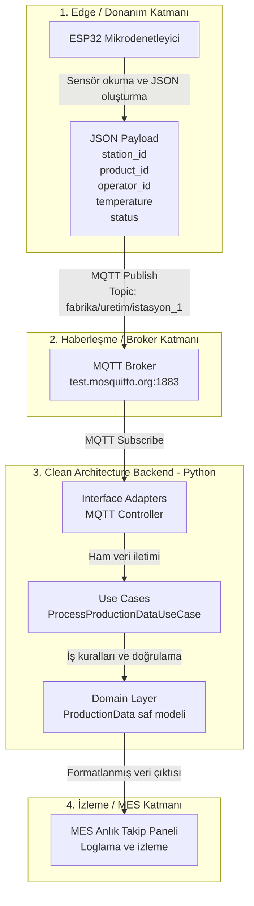
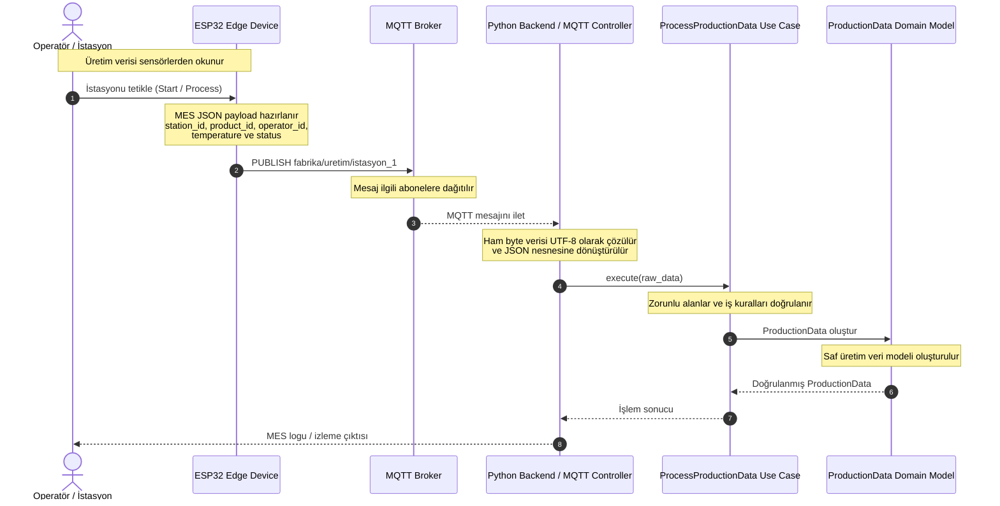
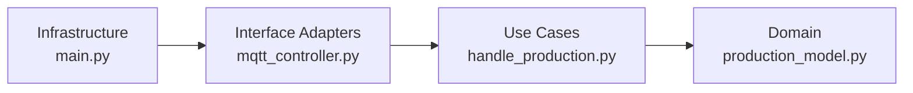
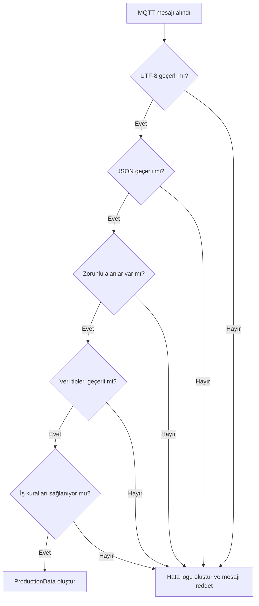
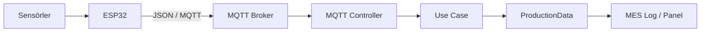

# 🏭 MES IoT End-to-End Architecture

Bu doküman, **ESP32** uç cihazları ile **Python** tabanlı arka plan sunucusu arasındaki haberleşmeyi sağlayan endüstriyel IoT projesinin mimari detaylarını içerir.

Sistem, **Clean Architecture** prensiplerine ve **MES (Manufacturing Execution System)** gereksinimlerine uygun şekilde katmanlandırılmıştır.

## Genel Bakış

Sistemin temel veri akışı aşağıdaki adımlardan oluşur:

1. ESP32, istasyondaki sensörlerden üretim verilerini okur.
2. Veriler JSON biçimine dönüştürülür.
3. JSON mesajı MQTT broker'a yayımlanır.
4. Python backend ilgili MQTT konusunu dinler.
5. Gelen mesaj, Interface Adapters katmanında ayrıştırılır.
6. Use Case katmanı veriyi doğrular ve iş kurallarını uygular.
7. Doğrulanan veri Domain modeline dönüştürülür.
8. Üretim verisi MES izleme paneline veya uygulama loglarına aktarılır.

---

## 1. Sistem Tasarımı ve Veri Akışı



---

## 2. Sequence Diagram

Aşağıdaki diyagram, istasyonun tetiklenmesinden üretim verisinin Domain modeline dönüştürülmesine kadar geçen mesaj akışını gösterir.



---

# MES Backend - Sistem Mimarisi ve Kullanım Senaryoları

Bu doküman, Manufacturing Execution System (MES) projesinin Clean Architecture prensiplerine dayalı mimari yapısını ve akış senaryolarını özetler.

## 3. Kullanım Senaryosu Diyagramı

```plantuml
@startuml
left to right direction

actor "Kayıtlı Kullanıcı / Operatör" as Operator
actor "ESP32 Cihazı" as ESP32

rectangle "MES Arka Uç Sistemi" {
    usecase "MQTT Verisi Gönder" as UC1
    usecase "MQTT Mesajını Yakala\n(MQTTController)" as UC2
    usecase "İş Mantığını İşle\n(ProcessProductionDataUseCase)" as UC3
    usecase "Veritabanına Kaydet\n(LocalDatabase / SQLite)" as UC4
    usecase "Üretim Loglarını Görüntüle" as UC5
}

Operator --> UC5
ESP32 --> UC1
UC1 --> UC2
UC2 --> UC3
UC3 --> UC4
UC4 ..> UC5 : Veri Kalıcılığı
@enduml
---

## 4. Uçtan Uca İş Akışı

```mermaid
flowchart TD
    Start(["Başlangıç<br/>İstasyon tetiklendi"])

    ReadSensor["ESP32 sensörleri okur<br/>Sıcaklık, durum ve üretim bilgileri"]

    CreateJSON["Veriler JSON formatına dönüştürülür<br/>station_id, product_id, operator_id,<br/>temperature ve status"]

    MQTTPublish["ESP32 veriyi MQTT broker'a yayımlar<br/>Topic: fabrika/uretim/istasyon_1"]

    BrokerQueue{"MQTT Broker<br/>test.mosquitto.org"}

    PythonSubscribe["Python backend MQTT konusunu dinler"]

    ParseData["Interface Adapters<br/>Ham byte verisini çözer ve JSON ayrıştırır"]

    ValidateData{"Use Cases<br/>Veri geçerli mi?"}

    RejectData["Hatalı veriyi reddet<br/>Hata logu oluştur"]

    DomainModel["Domain Layer<br/>ProductionData modeli oluştur"]

    OutputLog["MES takip paneline<br/>ve uygulama loglarına aktar"]

    End(["İşlem başarıyla tamamlandı"])

    Start --> ReadSensor
    ReadSensor --> CreateJSON
    CreateJSON --> MQTTPublish
    MQTTPublish --> BrokerQueue
    BrokerQueue -->|"Asenkron mesaj iletimi"| PythonSubscribe
    PythonSubscribe --> ParseData
    ParseData --> ValidateData

    ValidateData -->|"Hayır"| RejectData
    ValidateData -->|"Evet"| DomainModel

    RejectData --> PythonSubscribe
    DomainModel --> OutputLog
    OutputLog --> End
```



---

## 5. Clean Architecture Katmanları

| Katman | Sorumluluk | Örnek bileşen |
|---|---|---|
| **Domain** | Saf iş modellerini ve temel veri yapılarını içerir. | `ProductionData` |
| **Use Cases** | Veri doğrulama ve üretim iş kurallarını uygular. | `ProcessProductionDataUseCase` |
| **Interface Adapters** | MQTT mesajlarını uygulamanın anlayacağı biçime dönüştürür. | `MQTTController` |
| **Infrastructure** | MQTT istemcisi, broker bağlantısı, loglama ve uygulama başlangıcını yönetir. | `main.py` |

Temel bağımlılık yönü aşağıdaki gibidir:



> Clean Architecture prensibine göre iç katmanlar dış katmanları bilmez. Domain katmanı MQTT, broker, konsol veya başka bir altyapı bileşenine bağımlı değildir.

---

## 6. Proje Dosya Yapısı

```text
server/
├── domain/
│   ├── __init__.py
│   └── production_model.py
├── use_cases/
│   ├── __init__.py
│   └── handle_production.py
├── interface_adapters/
│   ├── __init__.py
│   └── mqtt_controller.py
├── infrastructure/
│   ├── __init__.py
│   └── logger.py
├── main.py
└── requirements.txt
```

### Dosya sorumlulukları

| Dosya | Sorumluluk |
|---|---|
| `domain/production_model.py` | Üretim verisinin saf Domain modelini tanımlar. |
| `use_cases/handle_production.py` | Doğrulama ve üretim iş kurallarını çalıştırır. |
| `interface_adapters/mqtt_controller.py` | MQTT mesajını ayrıştırır ve Use Case katmanına iletir. |
| `infrastructure/logger.py` | Uygulama ve MES loglama yapılandırmasını içerir. |
| `main.py` | MQTT istemcisini oluşturur ve uygulamayı başlatır. |
| `requirements.txt` | Python bağımlılıklarını tanımlar. |

---

## 7. Katmanlar Arası Bağımlılık Kuralları

1. **Domain katmanı**, herhangi bir framework veya MQTT kütüphanesi kullanmaz.
2. **Use Case katmanı**, yalnızca Domain modellerine bağımlıdır.
3. **Interface Adapters katmanı**, dış sistemden gelen veriyi Use Case katmanına uygun hale getirir.
4. **Infrastructure katmanı**, MQTT broker bağlantısı ve uygulama başlangıcı gibi teknik ayrıntıları yönetir.
5. MQTT bağlantısı değişse bile Domain ve Use Case kodları etkilenmemelidir.
6. MES loglama yöntemi değiştiğinde üretim veri modeli değiştirilmemelidir.

---

## 8. MQTT Haberleşme Sözleşmesi

| Alan | Değer |
|---|---|
| **Broker** | `test.mosquitto.org` |
| **Port** | `1883` |
| **Topic** | `fabrika/uretim/istasyon_1` |
| **Mesaj formatı** | JSON |
| **Karakter kodlaması** | UTF-8 |
| **Taşıma protokolü** | MQTT/TCP |

> `test.mosquitto.org` herkese açık bir test broker'ıdır. Üretim ortamında kimlik doğrulama, TLS, yetkilendirme ve kuruma özel bir MQTT broker kullanılmalıdır.

---

## 9. JSON Payload Sözleşmesi

### Örnek mesaj

```json
{
  "station_id": "ISTASYON_1",
  "product_id": "URUN_1001",
  "operator_id": "OPERATOR_42",
  "temperature": 24.7,
  "status": "PROCESSING"
}
```

### Alan açıklamaları

| Alan | Veri tipi | Zorunlu | Açıklama |
|---|---|---|---|
| `station_id` | String | Evet | Veriyi üreten istasyonun kimliğidir. |
| `product_id` | String | Evet | İşlem gören ürünün kimliğidir. |
| `operator_id` | String | Evet | İşlemi gerçekleştiren operatörün kimliğidir. |
| `temperature` | Number | Evet | Sensörden okunan sıcaklık değeridir. |
| `status` | String | Evet | Üretim işleminin güncel durumudur. |

### Desteklenen durum değerleri

```text
IDLE
PROCESSING
COMPLETED
ERROR
```

---

## 10. Mesaj Doğrulama Akışı

Backend'e gelen her MQTT mesajı aşağıdaki kontrollerden geçirilir:

1. Mesajın UTF-8 biçiminde çözülebilmesi gerekir.
2. Mesaj geçerli bir JSON nesnesi olmalıdır.
3. Zorunlu alanların tamamı bulunmalıdır.
4. Alanların veri tipleri beklenen tiplerle eşleşmelidir.
5. `temperature` sayısal bir değer olmalıdır.
6. `status`, desteklenen üretim durumlarından biri olmalıdır.
7. Geçersiz mesajlar Domain modeline dönüştürülmeden reddedilmelidir.



---

## 11. Örnek MES Log Çıktısı

```text
2026-01-15 10:24:32 | INFO | MQTT bağlantısı kuruldu
2026-01-15 10:24:35 | INFO | Topic dinleniyor: fabrika/uretim/istasyon_1
2026-01-15 10:24:41 | INFO | Üretim verisi işlendi
station_id=ISTASYON_1
product_id=URUN_1001
operator_id=OPERATOR_42
temperature=24.7
status=PROCESSING
```

Hatalı veri örneği:

```text
2026-01-15 10:25:18 | ERROR | Üretim verisi reddedildi
reason=Eksik zorunlu alan: product_id
topic=fabrika/uretim/istasyon_1
```

---

## 12. Güvenlik ve Üretim Ortamı Gereksinimleri

Üretim ortamına geçilirken aşağıdaki önlemler uygulanmalıdır:

- MQTT bağlantısında **TLS** kullanılmalıdır.
- Broker erişimi kullanıcı adı ve parola ile korunmalıdır.
- Her cihaz için ayrı kimlik veya sertifika tanımlanmalıdır.
- Topic bazlı yayınlama ve abonelik yetkileri uygulanmalıdır.
- Hassas bilgiler kaynak kodunda tutulmamalıdır.
- Broker adresi ve bağlantı bilgileri ortam değişkenlerinden okunmalıdır.
- Mesaj boyutu ve yayınlama sıklığı sınırlandırılmalıdır.
- Hatalı mesajlar ayrı bir hata kayıt mekanizmasında saklanmalıdır.
- Uygulama loglarında parola, token veya sertifika bilgisi bulunmamalıdır.
- İnternet bağlantısının kesilmesi durumunda yeniden bağlanma mekanizması kullanılmalıdır.

---

## 13. Hata Yönetimi

| Hata durumu | Beklenen davranış |
|---|---|
| Broker bağlantısı kesildi | MQTT istemcisi belirli aralıklarla yeniden bağlanmayı dener. |
| JSON ayrıştırılamadı | Mesaj reddedilir ve hata logu oluşturulur. |
| Zorunlu alan eksik | Domain modeli oluşturulmaz. |
| Geçersiz veri tipi | Mesaj reddedilir ve alan bilgisi loglanır. |
| Desteklenmeyen durum değeri | Use Case doğrulama hatası üretir. |
| Beklenmeyen uygulama hatası | Hata yakalanır, loglanır ve MQTT dinleme döngüsü korunur. |

---

## 14. Teknoloji Bileşenleri

| Bileşen | Teknoloji |
|---|---|
| Edge cihaz | ESP32 |
| Cihaz yazılımı | Arduino Framework veya ESP-IDF |
| Mesajlaşma protokolü | MQTT |
| Broker | Mosquitto |
| Backend | Python |
| MQTT istemci kütüphanesi | Eclipse Paho MQTT |
| Veri formatı | JSON |
| Mimari yaklaşım | Clean Architecture |
| Kaynak kod yönetimi | Git ve GitHub |

---

## 15. Gelecek Geliştirmeler

- MQTT mesajlarında **QoS 1** veya **QoS 2** desteğinin eklenmesi.
- TLS ve cihaz sertifikalarının uygulanması.
- Üretim verilerinin PostgreSQL veya zaman serisi veritabanında saklanması.
- Web tabanlı gerçek zamanlı MES panelinin geliştirilmesi.
- İstasyon ve cihaz kimlik doğrulamasının eklenmesi.
- Hatalı mesajlar için Dead Letter Queue yaklaşımının uygulanması.
- Docker tabanlı dağıtım altyapısının hazırlanması.
- Birim, entegrasyon ve uçtan uca testlerin eklenmesi.
- Prometheus ve Grafana ile sistem gözlemlenebilirliğinin artırılması.
- Broker bağlantı bilgilerinin ortam değişkenleri ile yönetilmesi.

---

## 16. Mimari Özet



